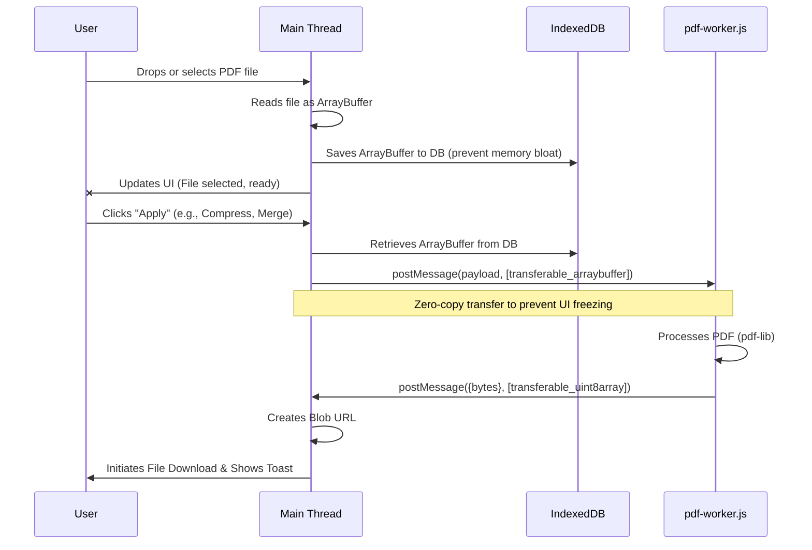

# PDFMinty Architecture

Welcome to the PDFMinty developer documentation. PDFMinty is a completely client-side PDF manipulation tool that runs entirely in the browser, ensuring user privacy by never uploading files to a server. 

## Data Flow & State Management

Because PDF processing can be resource-intensive, PDFMinty is designed with memory efficiency and non-blocking UX in mind. Here is how the system handles data under the hood:

### Key Technologies
1. **transferable objects**: Core buffers (`ArrayBuffer`, `Uint8Array`) are transferred, not copied, between the Main Thread and the Web Worker. This means the buffer changes ownership context rather than duplicating data, keeping the memory footprint low.
2. **IndexedDB (pdfDB)**: If a user selects a large PDF, keeping it in memory while other tools run could crash the browser tab. We temporarily store uploaded file chunks in IndexedDB and fetch them only when `btn-apply` is clicked.
3. **pdf-worker.js**: All heavy lifting using `pdf-lib` happens in the Web Worker. This guarantees that complex processes (like rendering, compressing, splitting) do not block or freeze the main browser UI thread.

---

## Creating a New Tool (3-Step Guide)

Adding a new tool to PDFMinty is modular and simple. We have centralized the UI rendering and file-handling logic so you only need to focus on what makes your tool unique.

### Step 1: Create the Setup Script
Create a new JS file in the `tools/` directory (e.g., `tools/my-new-tool.js`). Instead of writing raw HTML and event listeners, use our centralized `setupToolUI` function to define and scaffold the workspace.

\`\`\`javascript
import { setupToolUI } from '../utils/pdfToolsSetup.js';

(function() {
    setupToolUI({
        toolId: 'my-new-tool',
        title: 'My New PDF Tool',
        description: 'Does something awesome to your PDFs.',
        icon: '🚀',
        actionText: '🚀 Run Tool',
        isMultiFile: false, // Set to true if you need to merge/process multiple files
        settingsHtml: \`
            

                <label>My Setting Option</label>
                <input type="text" id="my-setting" />
            

        \`
        // onInit and onApply handled in Step 2 & 3
    });
})();
\`\`\`

### Step 2: Add Logic to Initialize and Apply (Main Thread)
Inside the `setupToolUI` configuration from Step 1, add the `onInit` and `onApply` hooks to capture UI input and trigger validation.

\`\`\`javascript
        onInit: () => {
            // Optional: Attach events to your custom HTML inputs here
            document.getElementById('my-setting').addEventListener('input', (e) => {
                console.log('User typed: ', e.target.value);
            });
        },
        onApply: async ({ actualBytes, currentFileName, filesArray }) => {
            // \`actualBytes\` is the PDF ArrayBuffer fetched from IndexedDB.
            
            // Gather input config
            const userInput = document.getElementById('my-setting').value;
            
            // Validate input
            if (!userInput) throw new Error("Please enter a setting value.");
            
            // Dispatch to worker
            const payload = { fileBytes: new Uint8Array(actualBytes), setting: userInput };
            
            // Notice: We pass the buffer in the secondary array to transfer ownership!
            const resultBytes = await window.runPdfWorkerTask('my_action_name', payload, [payload.fileBytes.buffer]);
            
            // Handle output
            downloadFile(resultBytes, \`\${currentFileName}-awesome.pdf\`);
            showSuccess('PDF processed successfully!');
        }
\`\`\`

### Step 3: Write the Processor (Worker)
Open `pdf-worker.js`. Locate the `switch (action)` block inside the `onmessage` listener and add a new case for your action name.

\`\`\`javascript
        case 'my_action_name': {
            const { fileBytes, setting } = payload;
            
            // Load document using pdf-lib
            const pdfDoc = await PDFDocument.load(fileBytes);
            
            // Do your processing operations here
            console.log('Processing with setting: ', setting);
            // ... (e.g. embed fonts, insert pages, etc)
            
            // Save output
            const finalBytes = await pdfDoc.save({ useObjectStreams: true });
            
            // Send back using transferable object zero-copy
            postMessage({ success: true, taskId, result: finalBytes }, [finalBytes.buffer]);
            break;
        }
\`\`\`

That's it! Register the tool link in your navigation and users can start using it immediately.
